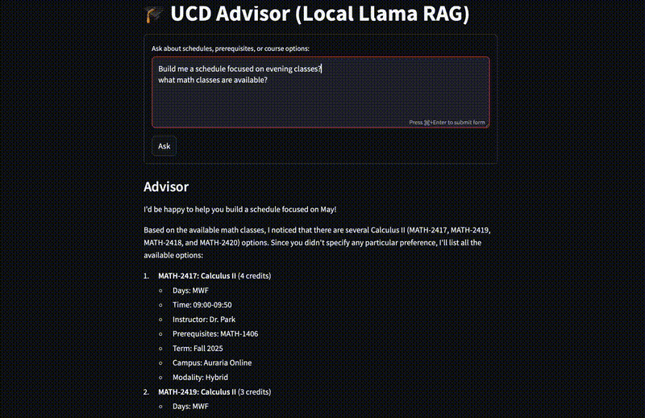

# 🎓 UCD Advisor

AI-assisted academic advising for the University of Colorado Denver. The service combines LangChain retrieval over a curated course catalog with OpenAI (or Ollama) models to propose schedules, highlight conflicts, and validate prerequisites. It can be run locally, deployed as a FastAPI backend (Render), and surfaced through a Streamlit UI (Streamlit Cloud or Render).

---

## 🎥 Demo



---

## 🧱 Project Structure

- `app.py` – FastAPI service and optional CLI entry point.
- `ingest.py` – builds the Chroma vector store from `data/courses.csv`.
- `ui_streamlit.py` – Streamlit client that calls the `/advise` API.
- `requirements_backend.txt` – dependencies for the FastAPI/ingest stack.
- `requirements.txt` – lightweight deps for the Streamlit UI (`streamlit`, `requests`).
- `chroma_ucd/` – persisted embeddings (generated by `ingest.py`).

---

## ⚙️ Local Setup

```bash
python -m venv .venv
source .venv/bin/activate  # Windows: .venv\Scripts\Activate.ps1
pip install -r requirements_backend.txt

# env vars (adjust as needed)
export LLM_BACKEND=openai
export OPENAI_API_KEY=sk-...
export EMBED_MODEL=text-embedding-3-small

python ingest.py        # builds chroma_ucd/
uvicorn app:api --reload  # or python app.py for CLI mode
```

Test locally:
```bash
curl "http://127.0.0.1:8000/advise?q=Plan%20a%2012-credit%20schedule"
```

To run the Streamlit UI locally while the API is up:
```bash
export API_URL=http://127.0.0.1:8000/advise
pip install -r requirements.txt
streamlit run ui_streamlit.py
```

---

## 🔁 Switching Backends

- **OpenAI (default)**: set `LLM_BACKEND=openai`, provide `OPENAI_API_KEY`, choose an OpenAI embedding model (e.g., `text-embedding-3-small`).
- **Ollama (optional)**: set `LLM_BACKEND=ollama`, ensure `OLLAMA_HOST` points to a running Ollama server, and pull the required models (`llama3`, `nomic-embed-text`). Re-run `python ingest.py` whenever you change backends or embeddings so the persisted vectors match the runtime model.

---

## 🌐 Deployment

### Backend (Render)

1. Push the repo with `requirements_backend.txt`, `requirements.txt`, and `runtime.txt` (pin Python 3.11.9).
2. Create a Render Web Service targeting this repo/branch.
3. Build command:
   ```
   pip install -r requirements_backend.txt && python ingest.py
   ```
4. Start command:
   ```
   uvicorn app:api --host 0.0.0.0 --port $PORT
   ```
5. Configure environment variables:
   - `LLM_BACKEND=openai`
   - `OPENAI_API_KEY=...`
   - `EMBED_MODEL=text-embedding-3-small` (or override)
   - `ALLOWED_ORIGINS=https://<your-streamlit-app>.streamlit.app`

Render persists the generated `chroma_ucd/` directory between deploys; rerun `python ingest.py` after data/model changes.

### Frontend (Streamlit Cloud)

1. Leave root `requirements.txt` minimal (`streamlit`, `requests`).
2. Add `.streamlit/runtime.txt` with `python-3.11.9`.
3. Deploy the repo on Streamlit Cloud with main file `ui_streamlit.py`.
4. In Streamlit **Secrets** (`Settings → Secrets`), add:
   ```toml
   API_URL = "https://<your-render-service>.onrender.com/advise"
   ```
5. Restart the app. The UI calls the deployed API and surfaces the response/validation details.

---

## 🌐 API

`GET /advise?q=<question>` → JSON payload:

```json
{
  "answer": "...",
  "suggested_course_ids": ["CSCI-2312", "MATH-1401"],
  "total_credits": 12.0,
  "time_conflict": false,
  "conflict_info": null,
  "unmet_prerequisites": []
}
```

Use the CLI (`python app.py`) for an interactive terminal experience with the same validation logic.

---

## 🧾 Environment Variables

| Variable | Purpose | Default |
| --- | --- | --- |
| `LLM_BACKEND` | `openai` or `ollama` | `openai` |
| `OPENAI_API_KEY` / `LLM_OPENAI_API_KEY` | OpenAI credentials | none |
| `CHAT_MODEL` | Chat LLM name | `gpt-4o-mini` |
| `EMBED_MODEL` | Embedding model id | `text-embedding-3-small` |
| `OLLAMA_HOST` | Ollama endpoint | `http://localhost:11434` |
| `CHROMA_DIR` | Persisted vector store path | `chroma_ucd` |
| `ALLOWED_ORIGINS` | Comma-separated CORS origins | `*` |
| `API_URL` | Streamlit → API URL (UI only) | `http://127.0.0.1:8000/advise` |

---

## ✅ Validation Logic

- Extract course IDs from model output via regex (`parse_course_ids`).
- Check overlapping times within day buckets.
- Aggregate credits from the catalog and flag unmet prerequisites.

If the assistant proposes conflicts or missing prerequisites, they surface in the CLI/Streamlit “Validation” section.

---

## 🧪 Next Steps

- Harden authentication/rate limiting for public access.
- Add automated tests (unit tests for conflict/prereq helpers).
- Extend ingest to handle updated catalogs or multiple terms.
